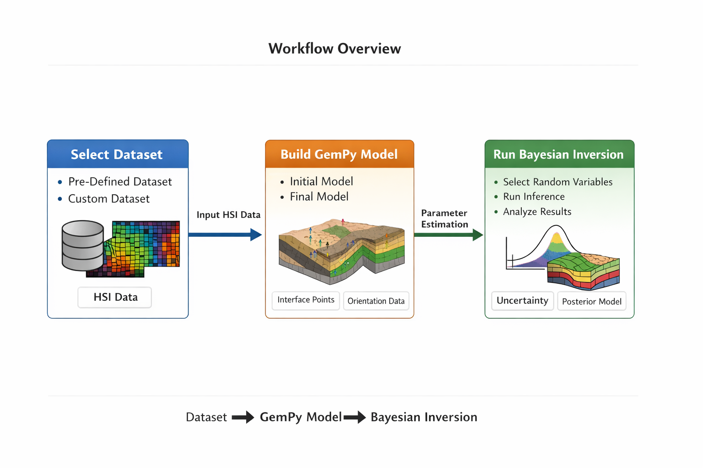

Create a environment with python version, python=3.10.13
Install gempy and related package with following version
- ⁠gempy==2023.2.0b1
- gempy-engine==2023.2.0b1
- gempy-probability==2023.2.0b1
- gempy-viewer==2023.2.0b1

## Workflow Overview


## 🧠 Methodology

GempyHSI implements **Bayesian inversion of geological models using hyperspectral images (HSI)** through two complementary approaches, depending on the type of information available from the observations.

---

### Method 1: Gempy_PSHD (Pre-Segmented Hyperspectral Data)

This method is used when **label information is available**, or when we can segment hyperspectral images into discrete classes.  

Workflow:

1. Apply a **Gaussian Mixture Model (GMM)** to the hyperspectral image to obtain pixel-wise **labels**.
2. Use the obtained **labels as scalar observations** for Bayesian inversion.
3. Estimate geological parameters consistent with the labeled observations.
4. Quantify uncertainty using hierarchical Bayesian inference.

**Use case:** Efficient when prior segmentation is available or labels can be derived from hyperspectral data.

---

### Method 2: Gempy_IBI_GMM (Gempy Integrated Bayesian Inversion with GMM)

This method is designed for **full hyperspectral data**, where we treat the high-dimensional spectra directly.  

Workflow:

1. Use the **full hyperspectral observation** for each pixel as input.
2. Treat a **Gaussian Mixture Model (GMM)** as the **likelihood function** in the Bayesian inversion.
3. Perform **parameter inference** integrating the probabilistic model directly with GemPy.
4. Quantify uncertainty and correlations in the inferred geological parameters.

**Use case:** Powerful for situations without pre-labeled data, allowing the inversion to learn class probabilities and geological parameters simultaneously.

---

Both methods are implemented in **GempyHSI**, providing flexibility to work with either labeled or fully observed hyperspectral data while maintaining a fully **Bayesian uncertainty framework**.

---

## 🐍 Environment Setup

This project requires **Python 3.10.13**.  
We strongly recommend creating a dedicated virtual environment for reproducibility.

---

## Option 1: Using `environment.yml` (Recommended)

The easiest way to set up the environment is to create it directly from the provided `environment.yml` file:
```bash
conda env create -f environment.yml
conda activate gempy_env
```
## Option 2: ⚙️ Create Environment (Conda Recommended)
```bash
conda create -n gempy_env python=3.10.13
conda activate gempy_env

pip install \
gempy==2023.2.0b1 \
gempy-engine==2023.2.0b1 \
gempy-probability==2023.2.0b1 \
gempy-viewer==2023.2.0b1

```
## 📂 Dataset Selection

The first step in GempyHSI is selecting the dataset. This is handled in `Dataframe.py`. 


## 🗂 Dataset Format Requirements

GempyHSI expects all datasets to follow a consistent structure so that the inversion workflows can run correctly.  

**1. `dataset.data`** – 2D array of shape `(num_pixels, num_features)`  

- **Columns 0–2:** `x, y, z` coordinates of each pixel (spatial location)  
- **Columns 3+:** spectral information (intensity or feature values) for each band, e.g., `[f1, f2, ..., fN]`  
  - These values represent the hyperspectral measurements at each pixel.  

**2. `dataset.labels`** – optional  

- Required only for workflows that use **labeled data** (`Gempy_PSHD`)  
- Should contain the class label for each pixel if available  

**Example of `dataset.data`:**

```text
dataset.data = [
  [x1, y1, z1, f1_1, f1_2, ..., f1_N],
  [x2, y2, z2, f2_1, f2_2, ..., f2_N],
  ...
]
### 1️⃣ Use a Pre-Defined Dataset

GempyHSI provides four built-in datasets. You can select one by setting the `user_data` variable in `setting_dataset()`:

```python
# Use one of the provided datasets
user_data = UserDataset(name="KSL_layer3")
# user_data = UserDataset(name="SalinasA")
# user_data = UserDataset(name="Syn_label")
# user_data = UserDataset(name="Syn_label_shift")
```
### 2️⃣ Use a Custom Dataset
```python
user_data = UserDataset(data=my_data_array, labels=my_labels_array)
```

## 🚀 Running GempyHSI

After selecting your dataset (`user_data`), GempyHSI automatically selects the appropriate inversion workflow based on the dataset format.

### Method Selection Logic

```python
if dataset.data.shape[1] > 3:
    # Dataset has spectral information
    run_hsi_label(dataset, geo_model_init geo_model_final=geo_model_final)
    # Alternatively, you can run the full HSI workflow:
    # run_hsi_full(dataset, geo_model_init, geo_model_final)
    
elif dataset.data.shape[1] == 3 and dataset.labels is not None:
    # Dataset has only coordinates + labels
    run_synthetic(dataset, geo_model_init, geo_model_final)
```
## ⚙️ Setting Parameters for Each Workflow

After selecting the dataset and letting GempyHSI choose the appropriate workflow, you need to configure **method-specific parameters**. Each workflow has its own Python file where these parameters can be adjusted:

| Workflow | Python File | Purpose |
|----------|-------------|---------|
| Hyperspectral with labels | `run_hsi_label.py` | Parameters for `Gempy_PSHD` inversion (e.g., GMM components, Bayesian priors) |
| Hyperspectral full | `run_hsi_full.py` | Parameters for `Gempy_IBI_GMM` inversion using full spectral likelihood |
| Synthetic / labeled | `run_synthetic.py` | Parameters for inversion with scalar/labeled data |

### Example Parameters

### Example: Running `hsi_full.py` with custom parameters

`Example snapshot from `hsi_full.py`:

```python
parser = argparse.ArgumentParser(description='pass values using command line')

# Columns of dataset to use as features
parser.add_argument('--startval', type=int, default=18, help='start column for features')
parser.add_argument('--endval', type=int, default=22, help='end column for features')

# Clustering / dimensionality reduction
parser.add_argument('--cluster', type=int, default=3, help='total number of clusters')
parser.add_argument('--dimred', type=str, default="pca", help='dimensionality reduction method')
parser.add_argument('--plot_dimred', type=str, default="tsne", help='dimensionality reduction method for plotting')

# Bayesian inversion parameters
parser.add_argument('--prior_number_samples', type=int, default=1000, help='number of prior samples')
parser.add_argument('--posterior_number_samples', type=int, default=500, help='number of posterior samples')
parser.add_argument('--posterior_warmup_steps', type=int, default=500, help='number of warmup steps')
parser.add_argument('--posterior_num_chain', type=int, default=5, help='number of MCMC chains')

# Output and dataset
parser.add_argument('--directory_path', type=str, default="./Results", help='directory to save results')
parser.add_argument('--dataset', type=str, default="Salinas", help='dataset name')

# GemPy-specific parameters
parser.add_argument('--slope_gempy', type=float, default=200.0, help='slope for GemPy model')
parser.add_argument('--scale', type=float, default=10.0, help='scaling factor for voxel probabilities')
```
### ⚠️ Dataset-Specific Notes for `slope_gempy`and `clusters`

The `--slope_gempy` parameter in GempyHSI controls the slope used in the GemPy model. Its value **depends on the dataset**:

| Dataset | Recommended `slope_gempy`    |  `clusters` |
|---------|------------------------------|-------------|
| Synthetic or KSL / KSL_layer3 | 200.0  |     3.      |
| SalinasA                      | 45.0   |     6.      |

> 💡 Tip: Keep the default value aligned with your dataset to ensure correct inversion behavior. If you provide a custom dataset, you may need to experiment with `slope_gempy` for optimal results.

## 🏗 GemPy Model Setup

Before running any inversion workflow in GempyHSI, you need to create a **GemPy geological model**. This includes:

- **Initial GemPy model** → serves as your starting guess  
- **Final GemPy model** → target model for inversion (used in some workflows)

### Location of Predefined GemPy Models

| Workflow | Initial Model | Final Model |
|----------|---------------|-------------|
| Gempy_PSHD / HSI with labels | `Gempy_PSHD/code_hsi_label/initial_gempy_model.py` | `Gempy_PSHD/code_hsi_label/final_gempy_model.py` |
| Gempy_PSHD / Synthetic data | `Gempy_PSHD/code_synthetic/initial_gempy_model.py` | `Gempy_PSHD/code_synthetic/final_gempy_model.py` |
| Gempy_IBI_GMM / Full HSI | `Gempy_IBI_GMM/HSI_full/initial_gempy_model.py` | `Gempy_IBI_GMM/HSI_full/final_gempy_model.py` |

> 💡 Tip: You can customize these models for your dataset. The **initial model** should reflect your best guess of the geological structure, while the **final model** is used for comparison or inversion evaluation.  

## 🔧 GemPy Model Details and Customization

GemPy models store the geological structure using:

1. **Interface points coordinates** – the x, y, z locations of interfaces between layers.  
2. **Orientation data** – the dip and strike of geological layers at specific points.  

### How to Customize

You have two main options to modify the model for inversion:

1. **Direct modification**  
   - You can manually update the coordinates or orientation values at specific points in the model file.  
   - This is useful for testing small changes or adding domain knowledge.

2. **Random variables for inversion**  
   - For Bayesian inversion, you can treat interface coordinates or orientations as **random variables**.  
   - The inversion workflow will then sample these variables according to the prior distributions you define, allowing the model to explore different geological structures automatically.

> 💡 Tip: By carefully choosing which points or orientations to treat as random variables, you can control which aspects of the geological model the inversion updates. This allows for efficient uncertainty quantification and better inversion results.

## 🎯 Defining Random Variables in the GemPy Model

In GempyHSI, you can define certain **interface points** in your GemPy model as **random variables** for Bayesian inversion. This allows the inversion workflow to update specific geological interfaces automatically.

### How It Works

1. Print the table of interface coordinates from your GemPy model:

```python
sp_coords_copy_test = geo_model_test.interpolation_input.surface_points.sp_coords.copy()
```
2. Select the indices of the points you want to treat as random variables. For example, in `hsi_full.py`, `hsi_label.py`, or `synthetic.py`:

```python
test_list = []

if dataset.name == "SalinasA":
    # Interface points to treat as random variables
    test_list.append({
        "update": "interface_data",
        "id": torch.tensor([1]),
        "direction": "Z",
        "prior_distribution": "normal",
        "normal": {
            "mean": torch.tensor(sp_coords_copy_test[1, 2], dtype=dtype, device=device),
            "std": torch.tensor(0.3, dtype=dtype, device=device)
        }
    })
    test_list.append({
        "update": "interface_data",
        "id": torch.tensor([4]),
        "direction": "Z",
        "prior_distribution": "normal",
        "normal": {
            "mean": torch.tensor(sp_coords_copy_test[4, 2], dtype=dtype, device=device),
            "std": torch.tensor(0.3, dtype=dtype, device=device)
        }
    })
    # Add more points as needed...
elif dataset.name == "KSL_layer3":
    test_list.append({
        "update": "interface_data",
        "id": torch.tensor([1]),
        "direction": "Z",
        "prior_distribution": "normal",
        "normal": {
            "mean": torch.tensor(sp_coords_copy_test[1, 2], dtype=dtype, device=device),
            "std": torch.tensor(0.02, dtype=dtype, device=device)
        }
    })
    # Add other points as needed...
else:
    test_list = None
```

## Explanation
1. id → index of the interface point in the GemPy surface points table
2. direction → which coordinate to vary (X, Y, or Z)
3. prior_distribution → type of prior to use (e.g., "normal")
4. mean → current value of the coordinate (from sp_coords_copy_test)
5. std → standard deviation of the random variable for the prior
## 💡 Example:
If your dataset is SalinasA, the interface point with id = 1 and Z coordinate (sp_coords_copy_test[1, 2]) will be treated as a random variable for Bayesian inversion.
This allows the inversion workflow to explore uncertainty in the model by sampling these points automatically.

## Datasets

The `Datasets/` directory contains all hyperspectral datasets used in this project.

Datasets/
│── Fw__Hyperspectral_datasets_from_the_KSL_cores/
│── HSI_Salinas/

---

### 1️⃣ Fw__Hyperspectral_datasets_from_the_KSL_cores

This folder contains hyperspectral datasets acquired from the Spremberg Site in Germany
.

These datasets are used for:

- Labeled hyperspectral experiments (`run_hsi_label`)
- Full hyperspectral Bayesian inversion (`run_hsi_full`)

#### Notes:
- For **KSL** and **Synthetic** experiments, we use: `gempy_slop = 200`
  
### 2️⃣ HSI_Salinas

This folder contains the Salinas hyperspectral dataset 
(typically SalinasA subset is used in experiments).

It is widely used in hyperspectral image classification research.

Used for:
- `run_hsi_label`
- `run_hsi_full`
#### Notes:
- For **SalinasA** dataset, we use: `gempy_slop = 45`

## Results Directory

All outputs are stored